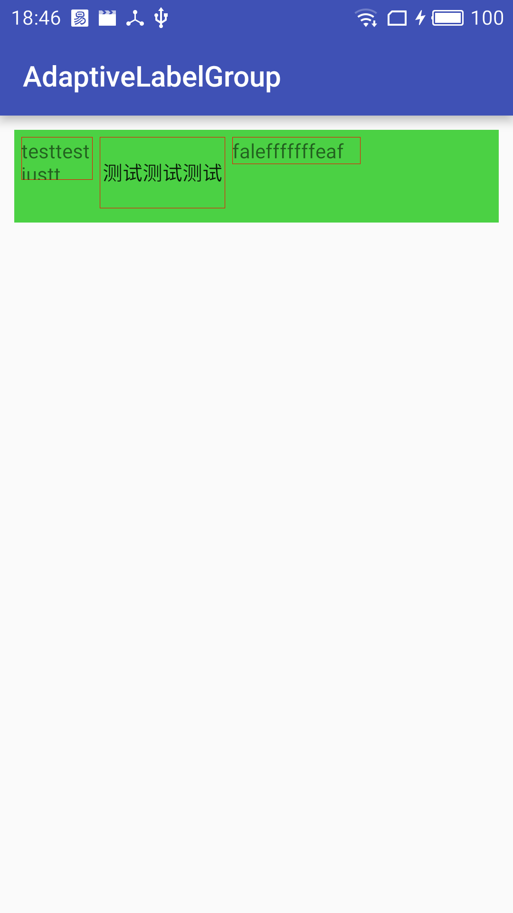

# AdaptiveLabelGroup
自适应标签容器，标签自动换行

----

# 效果


----

# 使用方法

## 1. 项目中引入依赖：

项目根目录下build.gradle中加入：
```
allprojects {
    repositories {
        ...
        maven { url "https://jitpack.io" }
    }
}
```
添加依赖：

```
dependencies {
    compile 'com.github.daemon369:AdaptiveLabelGroup:v0.0.1'
}
```
## 2. 布局文件中引用：

可以在布局中直接引用：
```
<RelativeLayout
    xmlns:android="http://schemas.android.com/apk/res/android"
    android:layout_width="match_parent"
    android:layout_height="match_parent"
    android:padding="10dp">

    <me.daemon.library.AdaptiveLabelGroup
        android:layout_width="match_parent"
        android:layout_height="wrap_content"
        android:background="#ffff0000">

        <TextView
            android:layout_width="wrap_content"
            android:layout_height="wrap_content"
            android:layout_margin="5dp"
            android:background="@drawable/bg_label"
            android:text="tesfaeafewfawfafleawlfelaflalllt" />

        <TextView
            android:layout_width="wrap_content"
            android:layout_height="wrap_content"
            android:layout_margin="5dp"
            android:background="@drawable/bg_label"
            android:text="falefffffffffflawleaf" />

        <TextView
            android:layout_width="wrap_content"
            android:layout_height="70dp"
            android:layout_margin="5dp"
            android:background="@drawable/bg_label"
            android:text="............................................" />

        <TextView
            android:layout_width="wrap_content"
            android:layout_height="30dp"
            android:layout_marginLeft="5dp"
            android:layout_marginRight="20dp"
            android:background="@drawable/bg_label"
            android:text="##" />

    </me.daemon.library.AdaptiveLabelGroup>
</RelativeLayout>
```
